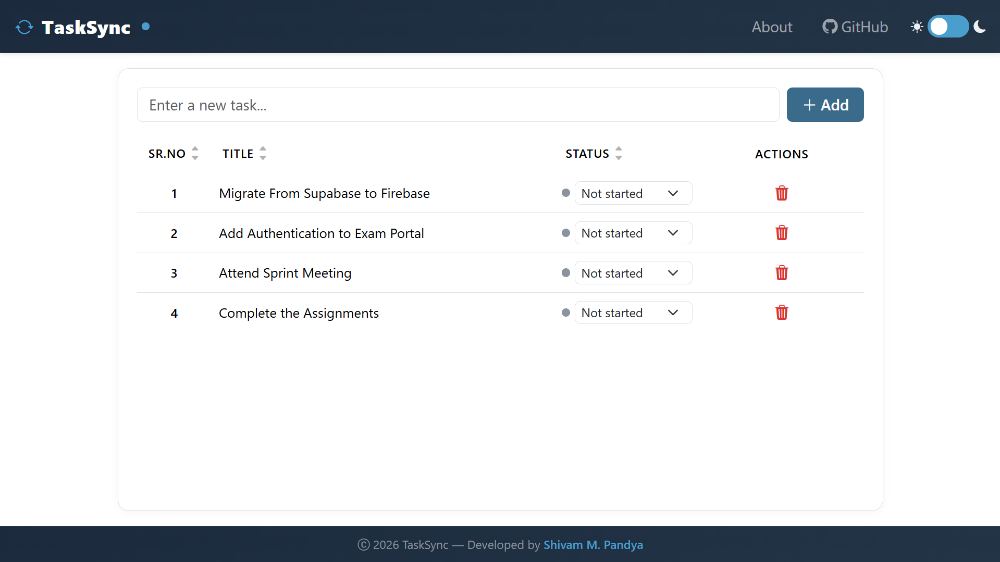
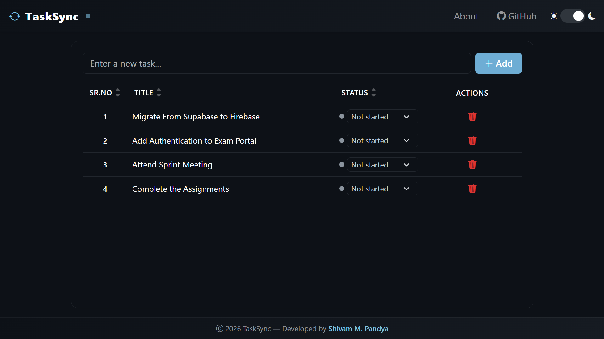
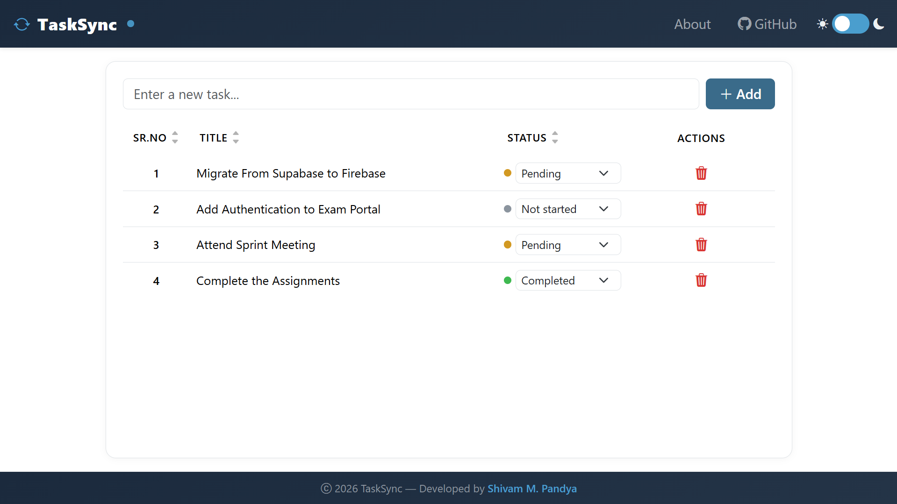
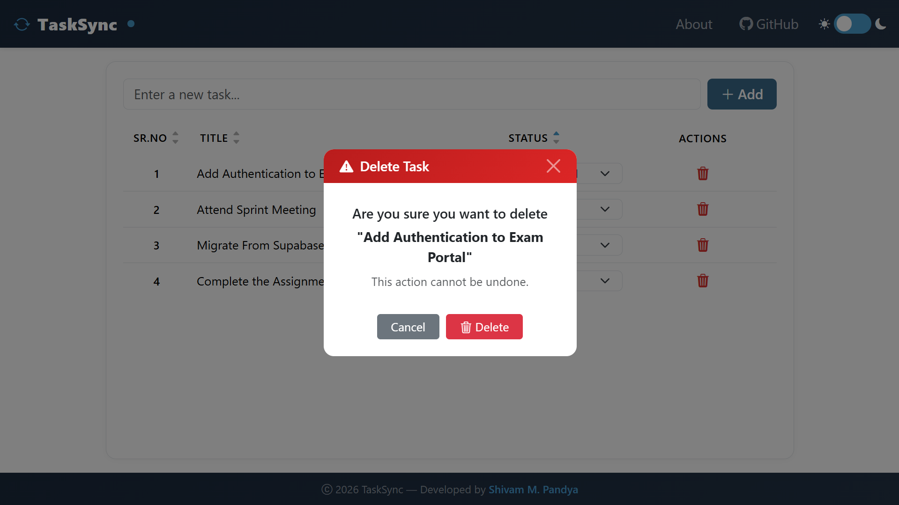
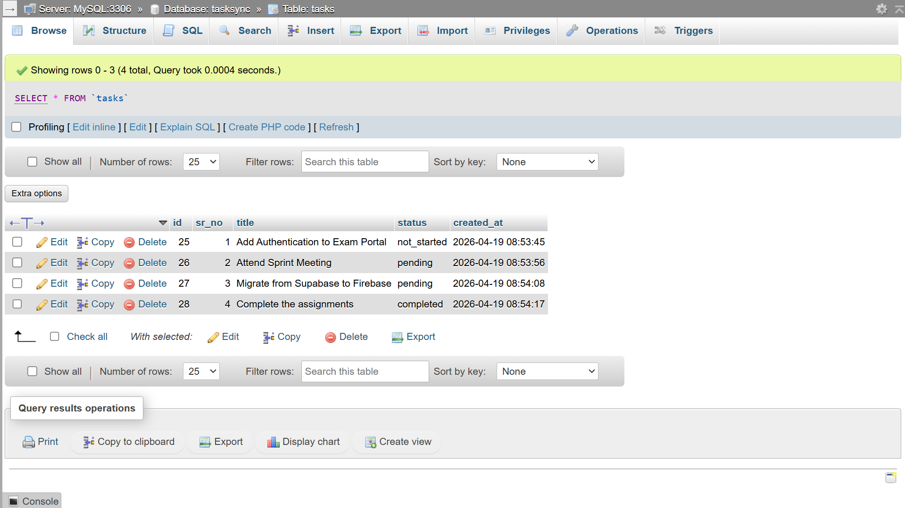
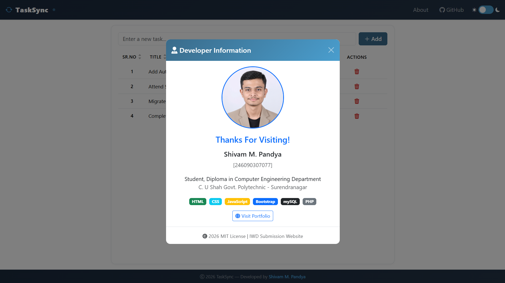

# TaskSync

TaskSync is a lightweight web-based task manager built with PHP, MySQL, Bootstrap, and vanilla JavaScript.
It provides a clean interface to add tasks, update progress, sort records, and remove tasks safely.

## Features

- Add new tasks with input validation.
- Update task status instantly:
	- `not_started`
	- `pending`
	- `completed`
- Tri-state sorting for table columns (`Sr.No`, `Title`, `Status`).
- Automatic serial number re-ordering after deletion.
- Delete confirmation modal before removing a task.
- Responsive UI with sticky table headers and scroll area.
- Light/Dark theme toggle with persistence in browser storage.

## Screenshots














## Tech Stack

- Frontend: HTML5, CSS3, Bootstrap 5, Bootstrap Icons, Font Awesome, Vanilla JavaScript
- Backend: PHP (procedural + MySQLi)
- Database: MySQL

## Project Structure

```
TaskSync/
|- index.html       # Main task management UI
|- about.html       # Project and developer information page
|- api.php          # Backend API/controller for task operations
|- database.sql     # Database and table creation script
|- assets/
|  \- images/       # Static assets (developer image, etc.)
```

## Prerequisites

- PHP 8.x (or compatible)
- MySQL / MariaDB
- Apache (or any web server that can run PHP)
- WAMP/XAMPP/LAMP stack

## Local Setup

1. Copy this project folder to your web root.
	 - Example (WAMP): `c:/wamp64/www/TaskSync`
2. Start Apache and MySQL services.
3. Create database and table:
	 - Open phpMyAdmin or MySQL CLI.
	 - Import `database.sql`.
4. Verify DB credentials in `api.php`:
	 - Host: `localhost`
	 - User: `root`
	 - Password: `` (empty by default in many local setups)
	 - Database: `tasksync`
5. Open in browser:
	 - `http://localhost/TaskSync/index.html`

## Database Schema

`database.sql` creates:

- Database: `tasksync`
- Table: `tasks`
	- `id` (INT, AUTO_INCREMENT, PRIMARY KEY)
	- `sr_no` (INT, not null)
	- `title` (VARCHAR(255), not null)
	- `status` (ENUM: `not_started`, `pending`, `completed`)
	- `created_at` (TIMESTAMP default current time)

## API Endpoints (via `api.php?action=...`)

- `add` (POST)
	- Input: `title`
	- Behavior: Inserts new task and redirects to `index.html`

- `fetch` (GET)
	- Query params: `sort` (`sr_no|title|status`), `dir` (`ASC|DESC`)
	- Behavior: Returns task list as JSON

- `update_status` (POST)
	- Input: `id`, `status`
	- Behavior: Updates task status, returns JSON success

- `delete` (POST)
	- Input: `id`
	- Behavior: Deletes task, reorders `sr_no`, returns JSON success

## Notes

- Sorting arrows in UI indicate ascending/descending state.
- Table row serial number is rendered on the client side based on current sorted view.
- Theme preference is stored in `localStorage` under key `ts-theme`.

## Security/Production Considerations

This project is configured for local development. Before deploying to production, update:

- Database credentials (do not use root account)
- Error handling/logging strategy
- Input/output hardening and stricter validation rules
- CSRF protection for mutating requests
- Proper authentication/authorization (if multi-user support is needed)

## Author

- Shivam M. Pandya

## License

Educational/project use. Not for commercial distribution without permission.